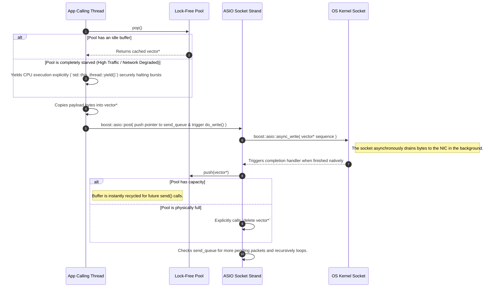
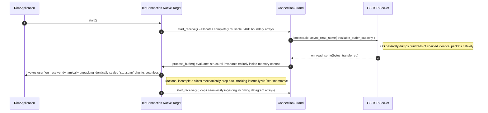
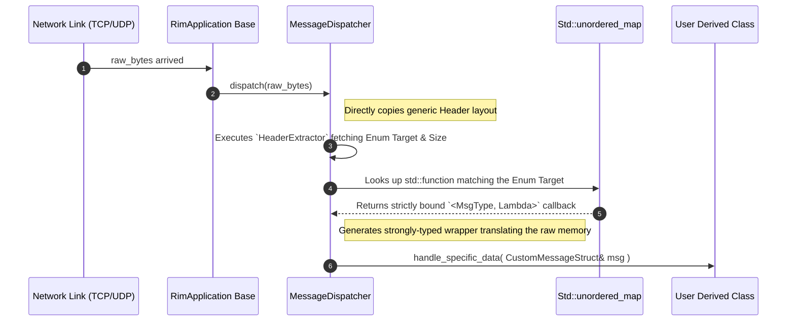

# Librim Software Architecture

This document delves into the internal mechanics of `librim`. It is intended for software engineers and maintainers who need to fundamentally understand *how* the library achieves high-performance concurrent networking, thread safety, and lock-free execution without relying on explicit mutexes over the critical path.

---

## 1. Core Principles & Concurrency Model

### Boost.ASIO & The [Context](include/librim/context.hpp#L19-L95) Object
At the absolute center of the library sits the `librim::Context`. It manages a single `boost::asio::io_context` and a pool of native `std::thread` workers. 
Rather than creating separate threads for reading, writing, and polling explicitly, `librim` leans on the Proactor design pattern. The OS asynchronously notifies the `io_context` when physical sockets have data or when writes finish, and the context delegates the associated completion callbacks ("handlers") to *any* available thread in the [Context](include/librim/context.hpp#L19-L95) pool.

### The Problem with Mutexes
Because handlers can be invoked by any thread randomly, standard object state (like a client's specific socket buffer, active timers, or send queues) is highly susceptible to race conditions. The legacy approach is to wrap all state inside a large `std::mutex`. As identified in prior profiling, massive concurrency causes severe mutex contention (threads stall waiting to acquire locks to simply push a byte array to a socket).

### The Solution: ASIO Strands
Instead of `mutex`, `librim` assigns a `boost::asio::strand` to every single [TcpConnection](include/librim/tcp_server.hpp#L47-L69), [TcpClient](include/librim/tcp_client.hpp#L48-L67), and [UdpEndpoint](include/librim/udp_endpoint.hpp#L26-L316) internally.
A "strand" strictly guarantees that execution handlers posted to it will run **sequentially**, never concurrently. Even if 10 threads try to trigger a [do_write](include/librim/tcp_server.hpp#L151-L180) callback simultaneously, the strand explicitly orchestrates them so exactly 1 executes at a time for that specific socket. This inherently makes all internal socket state (buffers, queues, and timers) completely thread-safe without ever blocking execution via kernel-level `mutex` suspensions.

---

## 2. Lock-Free Memory Pipeline

When user code calls `client->send(data)`, the caller thread naturally executes much faster than the OS can actually push bytes through the physical NIC. Handlers must queue the outgoing memory chunks safely into an intermediate buffer sequence.

If 50 UI threads concurrently call [send()](include/librim/udp_endpoint.hpp#L205-L216), standard `std::deque` logic would break without a mutex. To resolve this, `librim` introduces a physical `boost::lockfree::queue<std::vector<std::byte>*>` alongside a contiguous `boost::circular_buffer`.

### Fast-Path Memory Allocation Sequence
When any thread attempts to broadcast, it asks the lock-free pool natively for an idle memory allocation (`pop`). If the pool is temporarily starved under high traffic, the calling thread simply yields its CPU slice explicitly (`std::this_thread::yield()`), organically backpressuring application rates to match OS kernel limits. Because the lock-free pool is strictly pre-allocated with exactly 8192 uniformly-sized buffers upon endpoint construction, `librim` completely eradicates dynamic heap allocations (`new`/`delete`) and allocator locks (`mmap`) entirely off the hot path! Once a buffer is acquired via `.pop()`, the data is statically assigned and passed to the Strand, which sequentially aggregates it inside a fixed-capacity `boost::circular_buffer` to eliminate L1 cache penalty traversals efficiently.

---

## 3. TCP Receiver Lifecycle & Framing Loop

TCP is a stream protocol; it has no concept of "messages." It only knows sequences of continuous bytes.
`librim`'s architecture explicitly requires users to prepend packets with a fixed structural Header indicating the exact dimension of the arriving packet (e.g., standard TLV structures).

The [TcpConnection](include/librim/tcp_server.hpp#L47-L69) instance intrinsically loops a continuous sliding-window ingestion mechanic bound cleanly within its explicit strand.

Instead of issuing tiny individual sequential asynchronous reads for headers followed by payloads—which violently maximizes identical expensive kernel syscall mappings under heavy load—`librim` aggressively leverages a highly efficient massive `async_read_some` block slurping contiguous frame aggregations indiscriminately safely.

---

## 4. Message Dispatcher Mechanics

To prevent the User from having to write massive chaotic `switch/case` byte casting cascades identically evaluating different data types, `librim` features the [MessageDispatcher](include/librim/message_dispatcher.hpp#L22-L167).

The Dispatcher is explicitly initialized with two templates: the custom `Enum` identifying packet classes securely, and the custom [Header](include/librim/async_logger.hpp#L28-L34) formatting defining the protocol natively.

---

## 5. Safely Shutting Down

Because ASIO strands process events indiscriminately across background threads, closing sockets manually crashes applications drastically natively if wait-timers or `async_send_to` calls overlap with the `delete` of the native File Descriptor securely routing them.

**Librim solves this structurally:**
All [close()](include/librim/udp_endpoint.hpp#L249-L266) hooks are explicitly redirected into the protective Strand execution layer natively via `boost::asio::dispatch(strand_, ...)`. This guarantees the asynchronous loop physically finishes resolving the active network block logic entirely before deleting the connection handles gracefully!
